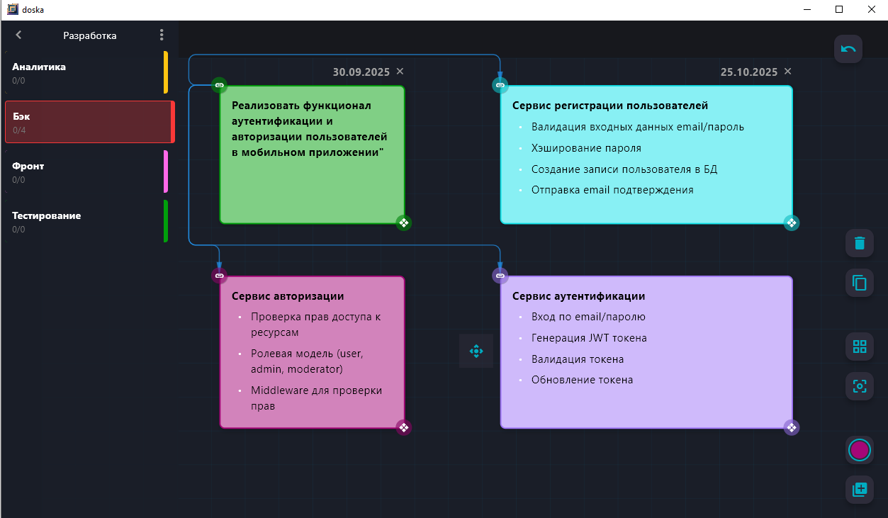
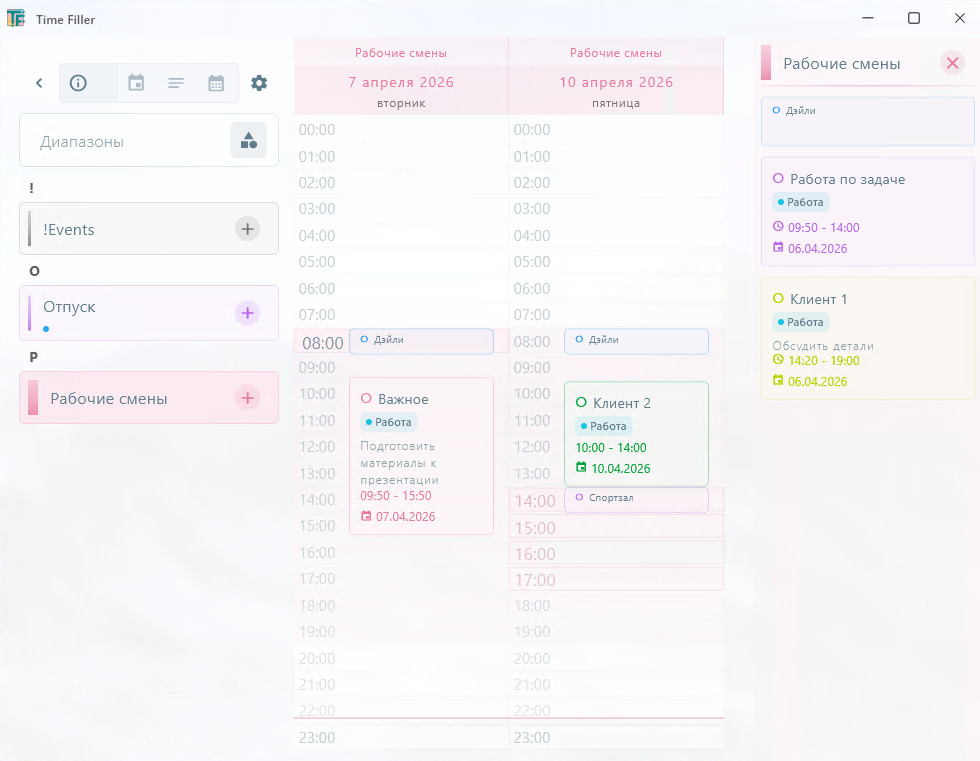

# Pudra Soft

### Молодой стартап, создающий десктопные инструменты для планирования и управления проектами.

Мы верим, что хороший софт не должен быть сложным или дорогим. Поэтому наши приложения распространяются бесплатно, без
рекламы и подписок. Всё работает локально — никаких облаков, серверов и скрытых платежей.

## О нас

Мы — молодой стартап, который находится в самом начале пути. Главная цель сейчас — не заработок, а быстрая разработка и
тестирование идей. Именно поэтому мы сознательно отказались от облачных решений на этом этапе.

Почему? Потому что облако требует сложной инфраструктуры, серверов и бесконечных доработок. Это здорово замедляет
процесс.

Нам важно выпускать продукты быстро, получать вашу обратную связь и делать их лучше здесь и сейчас. Поэтому наши
приложения — это десктопные решения, которые вы скачиваете и используете бесплатно. Никаких подписок, никаких скрытых
платежей.

А облачные решения мы разрабатываем по предзаказу для компаний, которые заинтересованы в оптимизации своих процессов.
Для тех, кому нужен доступ с любого устройства и корпоративные возможности.

## Наши продукты

### DoSka

Персональный конструктор проектов для Windows

DoSka — это простой и мощный инструмент для визуального планирования. Он поможет структурировать любую задачу: от
бизнес-процесса до учебного проекта.

Приложение работает полностью локально, без интернета и облаков. Все данные остаются только на вашем компьютере.

#### Основные возможности:

- Гибкое проектирование структуры — создавайте иерархические списки задач (WBS)
- Сбор пользовательских историй (User Story)
- Визуализация процессов и техкарт
- Декомпозиция задач «сверху вниз»
- Доски и заметки — до 15 досок в проекте, до 100 заметок на каждой
- Связи между заметками — стройте логические цепочки любой сложности
- Чек-листы

Подходит для: проектных менеджеров, бизнес-аналитиков, разработчиков и всех, кто работает над сложными задачами.

### Time Filler

Локальный планировщик для небольших команд

TimeFiller — это планировщик для Windows, созданный для управления сменами, отпусками, встречами и регулярными
событиями. Приложение работает полностью автономно, без подключения к интернету.

#### Основные возможности:

- Управление отпусками сотрудников
- Запись клиентов и планирование встреч
- Планирование регулярных событий
- Поддержка спринтов
- Создание графиков смен (2 через 2, 5/2 и др.)
- Фильтрация по категориям
- Гибкое редактирование и смещение смен

Подходит для: небольших команд, руководителей, HR-специалистов и всех, кому нужно простое и надёжное расписание.

### Ключевые преимущества

- ✅ Полная автономность — без интернета и облаков
- ✅ Мгновенная установка из одного файла
- ✅ Все данные под вашим полным контролем
- ✅ Бесплатно для частного использования
- ✅ Никаких подписок и скрытых платежей
- ✅ Работает на Windows 10 и 11

### Техническая поддержка

Бесплатная поддержка через официальную группу ВКонтакте:
https://vk.ru/pudra_soft

### Контакты

Разработчик: Pudra Soft Сайт: https://pudra-soft.ru
Поддержка: https://vk.ru/pudra_soft